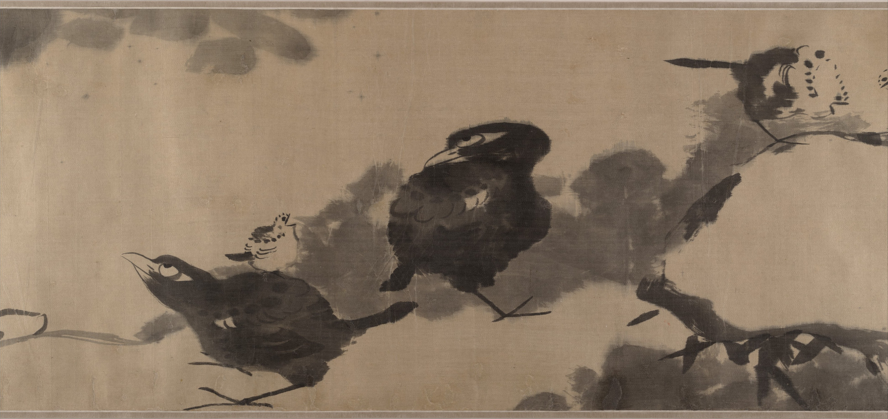

河上花，一千葉，六郎買醉無休歇。\
萬轉千迴丁六娘，直到牽牛望河北。\
欲雨巫山翠蓋斜，片雲卷去昆明黑。\
饋而明珠擎不得，塗上心頭共團墨。\
蕙嵒先生憐余老大無一遇，萬一由拳拳太白。\
太白對予言：博望侯，天般大，葉如梭，在天外，六娘劍術行方邁。\
團八月吳兼會，河上仙人正圖畫。\
撐腸拄腹六十尺，炎涼盡作高冠戴。\
余曰：匡廬，山密林邇，東晉黃冠亦朋比，算來一百八顆念頭穿。\
大金剛，小瓊玖，爭似圖畫中。\
實相無相，一顆蓮花子。\
吁嗟世界蓮花裏。\
還舟未？樂歌行，泉飛疊疊花循循。\
東西南北怪底同，朝還並蒂難重陳，至今想見芝山人。

——

蕙嵒先生囑畫此卷，自丁丑五月以至六、七、八月，荷葉、荷花落成，戲作河上花歌僅二百餘字呈正。八大山人。

——

卷藏天津博物館，紙本水墨，47×1292.5 cm。

——

蕙嵒，揚州畫家，先從石濤學畫，後南下從八大遊。八大《[與石濤書](與石濤書.md)》「丈室蕙嵒是一」即此人。\
朱良志〈石濤與八大山人相關作品辨析〉（北大人文學部）論之甚詳。
