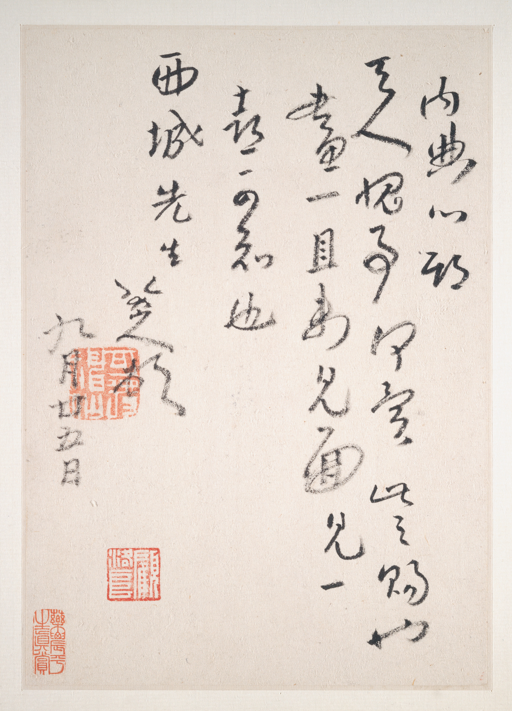
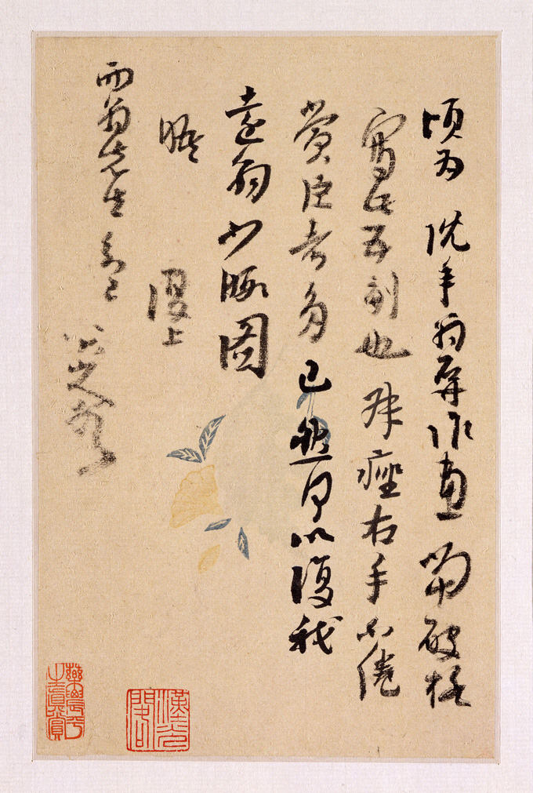
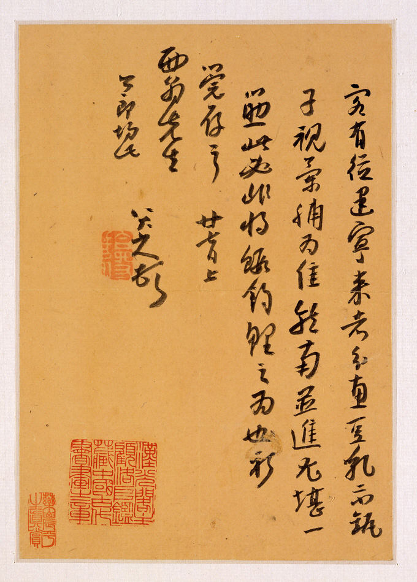
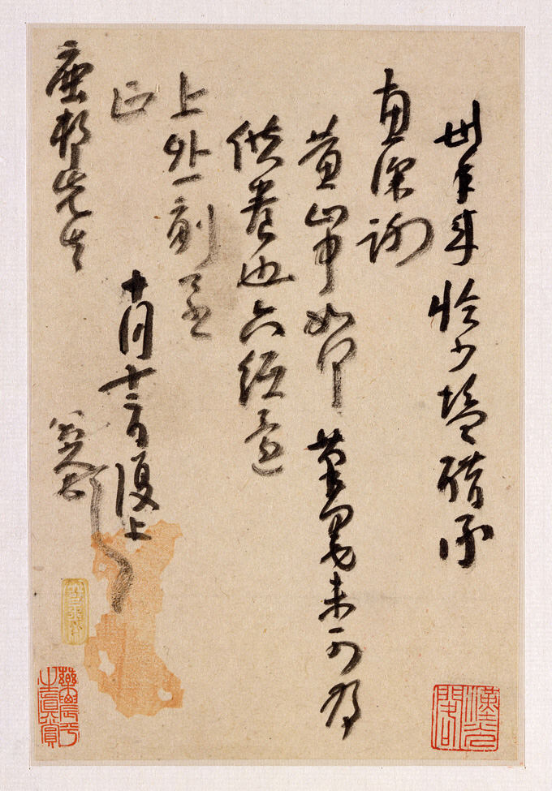
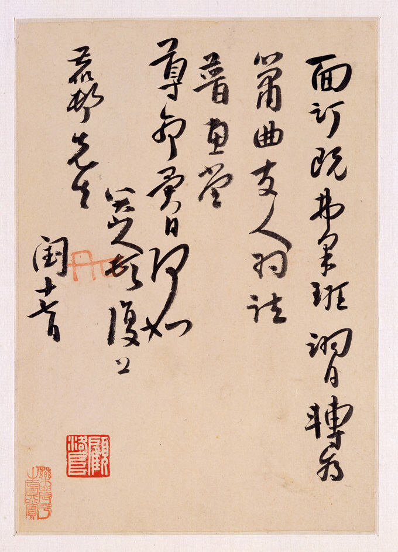
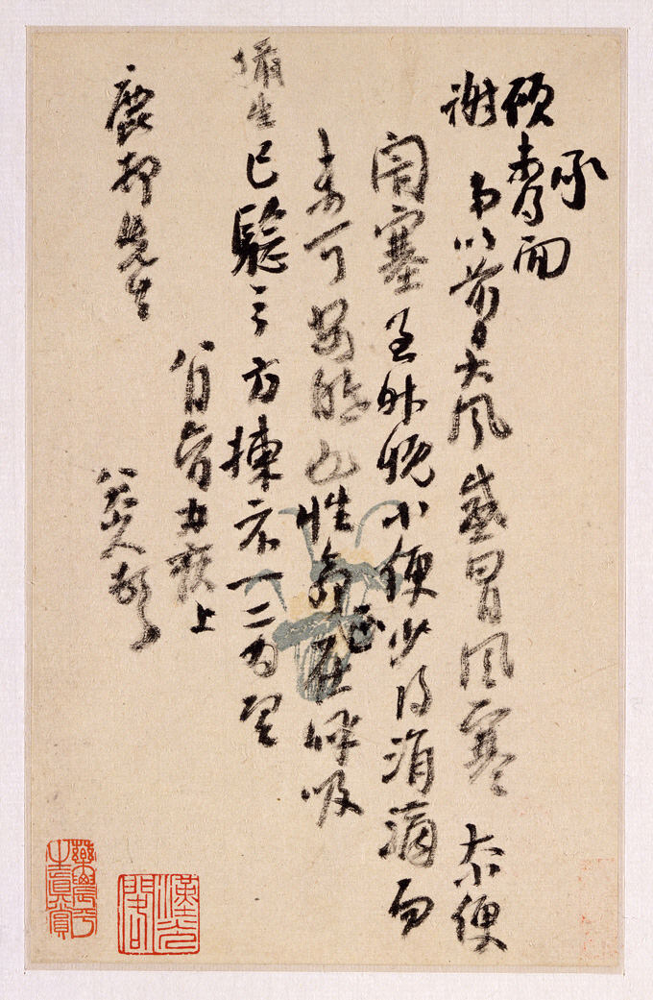
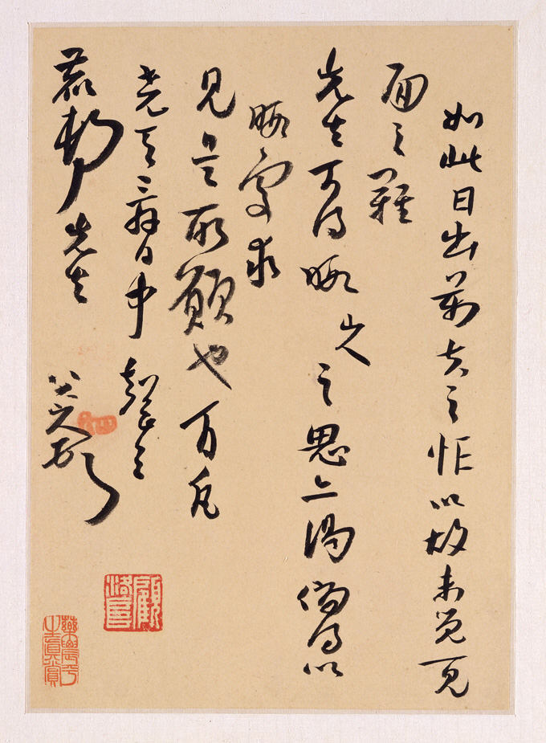
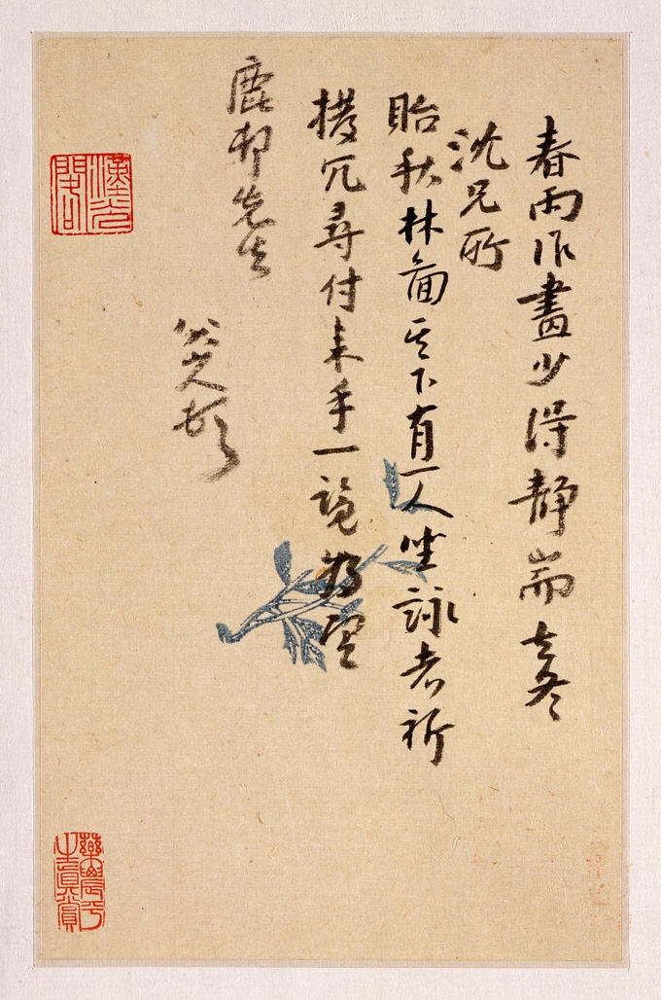
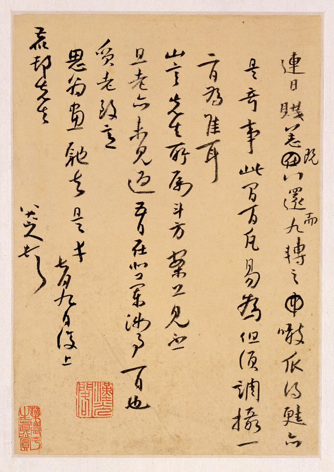

## 其一

專使促駕，如此之重重疊疊上瑤臺也，可勝榮幸！翊晨趨承，轉致意介老玉郎為望。

四月既望，複上鹿邨先生。八大山人頓首。

## 其二

迮地放寬乃爾，拜上澹公，黃鳥一聲，酒一杯，佳句也要人續。玉郎在座可會得？山人出沒此南屏裡，畫未有艾也。

附謝鹿邨先生。四月廿八日。八大山人頓首。

## 其三

畫二奉令宗兄，過高有可易者否？外字一副，祈轉致之。但未知行期何日耳。承賜已合醬，深謝。

六月二日複上鹿邨。八大山人頓首。

## 其四

牛未沒耳，驢若向北，鹿邨主人嚼得梅花，何以謝我鼐也？昨有貴人招飲飯牛老人與八大山人，山人已辭著屐，老寧無畫几席耶？山人尊酒片肉之歲卒於此耶？遇老人為道恨他不少，且莫為貴人道。奉別來將一月，右手不倦，賞臣者倦矣。但可為知己道。

十二月十三日。八大山人頓首。

## 其五

只手少甦，廚中便乏粒，知己處轉掇得二金否？前著重侄奉謁，可道及此。究之參苓、白術，日用僅止此耶？凡夫只知死之易，而未知生之難也，言之可為於至！

上鹿邨先生。八大山人頓首。

是月夢漁兄遠自常德寄參五錢，亦是奇事並聞。

## 其六

瓶砵分張，未敢期也。先意是承拜登為愧，適為友人塗抹得一副，迺花王也，大是懵懂。題雲：

> 婆子春秋節，臺灣道路賒。\
> 聞雞三五夜，失曉對菱花。

方丈定當之。四月廿一。八大山人頓首。

## 其七

窮變得意處，唯是重喜，重慶，垂愛為愧！眷西堂聯可轉致之。

廿六日複上鹿邨先生。八大山人頓首。

## 其八

斗方八卷，一側一圖。上別後周旋書問，至今想見敝閣涉筆，連朝紐醜，拊掌者誰耶？辱惠大慚，嗣當補偏，外忝鷗鶿一為求正。惟伯仲筦存之。尊作可用印子寄到為望。

西老社翁先生。八大山人頓首。一月廿日。

## 其九

二俱國珍見遺，惟寶貝之，將何以為報？既望既雨踵謝，既處方丈一絕領到。

西老年翁。八大山人頓首。七月八日。

## 其十

乳茶雲可卻暑，少佐茗碗，來日為敝寓試新之日也。至於八日，萬不敢爽。

西翁先生。八大山人頓首。稚老均此。

## 其十一

廿八日賜顧是實，敢日左之，以為此雲山之服也。暇得必將福壽二字轉致之也。伏惟先生圖之。

西老社翁先生。八大山人頓首。一月卅。

## 其十二

四韻遵示書之，拙作可附驥去。畫十一編次，一併附去。黜陟之乃佳也。龍門一宿覺，先生便騎馬到階除，或雲訪戴，此假道也，是耶？途中昨得一絕：

> 苦雨經旬忘，筇州杖莫旋。\
> 如今石崇路，花放與苔錢。

祈晴萬壽宮六、七日，已花好，無從一見面。好花決無甚好處耳，為之奈何。

修禊先日，複上西老社翁。八大山人頓首。

## 其十三

百凡庋之高閣可得耶？翊晨石亭寺於兩處答拜，然後可聯袂也。扶昇兄至不？未至必往。

西翁兄。八大山人頓首。

——

紐約大都會藝術博物館藏《Letters to Fang Shiguan》（1982.458a–e）五對開九葉：

——

書札十三通本文據王方宇、班宗華《Master of the Lotus Garden》（耶魯 1990 cat. 73）整理本錄入。

按：大都會本實為十札（五對開：a–e），紙本水墨。本頁所錄十三通中部分當見大都會本，另數通或為王方宇舊藏散件、香港至樂樓藏件，待逐件對勘。

方士琯（1650?–?），字鹿村，又作鹿邨、西翁，徽州歙縣鹽商，八大晚年最重要之物質贊助人。
