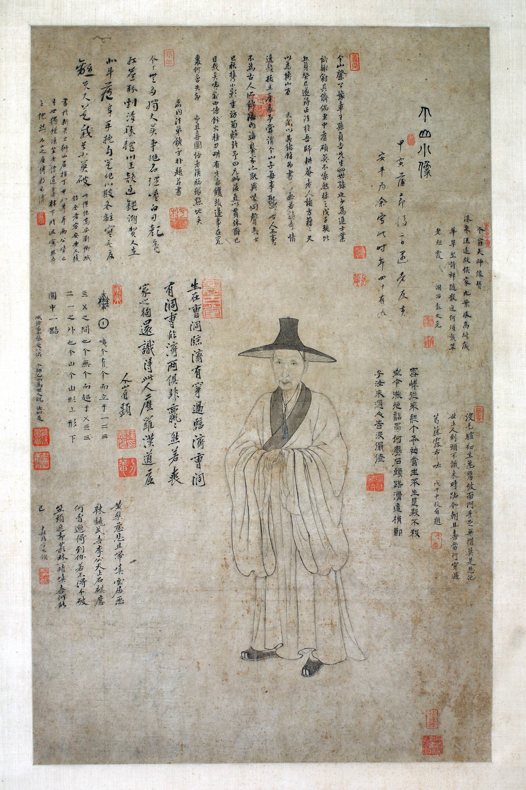

:::hero {.plate}

:::

康熙十三年甲寅（1674）蒲節後二日，老友黃安平為余寫此像。時年四十有九。

像上自題二段，又有饒宇樸（嗇庵）、彭文亮、蔡受、劉慟城諸君題識，凡九段。詳見[文/個山小像](../文/個山小像.md)、[文/世系](../文/世系.md)。

——

館藏官網：[bdsrjng.cn](http://www.bdsrjng.cn/products_details/1.html)。\
鈐印：「個山」、「雪個」、「釋傳綮印」、「刃菴」、「懷古堂」、「耕香」、「掣顛」（共七方）。\
九段題跋中六段為八大山人自題，各用真、草、隸、篆四體書寫。\
1955 年發現於奉新縣奉先寺。
