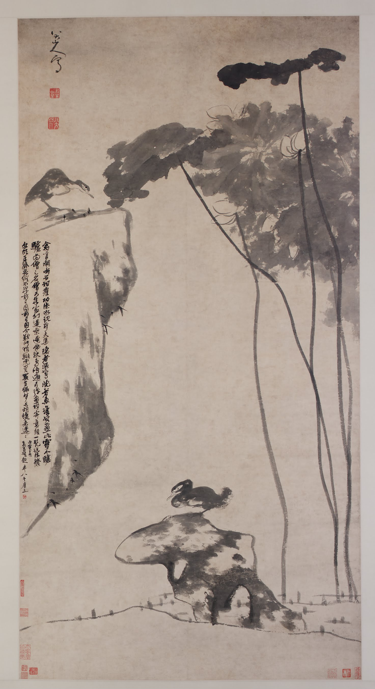

:::hero {.plate}

:::

款署「八大山人」。

鈐印：「在芙山房」白文方印、「八大山人」白文長方印、「遙屬」朱文長方印。

吳昌碩丙寅（1926）八十三歲跋詩：「鳥語格磔石面齊／德業出蓮人之池／隱者鷗鷺沒者魚／曾經畫此誰雪驢／驢即和尚和尚朱／盤腿坐于荷葉間／鳥啼花落彈聲彈／畫禪意盡頭陀僧／說法又似明遺珉／花不結子徒因緣／徒因緣／嘆息今／豺狼勝虎熊產狐／成夢蝴蝶飛來來」。款後鈐「老缶」朱文方印。

——

外簽（張大千行書）：「八大山人荷花雙鳧晚作真跡神品，吳昌碩題詩，大風堂供養。」

王方宇、沈慧伉儷舊藏（張大千→王方宇→Wang Shao F. 三代秘藏）。

著錄：Chang, Bai & Allee, *In Pursuit of Heavenly Harmony*（弗利爾 2003），cat. 9, pp. 66–67。
