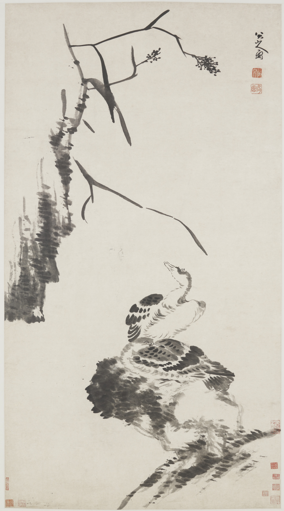

:::hero {.plate}

:::

款署「八大山人寫」。

鈐印：「八大山人」白文方印、「何園」朱文方印、「遙屬」白文方印。

——

無紀年款。張大千外簽：「八大山人晚年所作《蘆雁》，大風堂供養」（朱文鑑藏印八方）。後歸王方宇、沈慧伉儷，捐贈弗利爾。

著錄：Joseph Chang, Qianshen Bai & Stephen D. Allee, *In Pursuit of Heavenly Harmony: Paintings and Calligraphy by Bada Shanren from the Estate of Wang Fangyu and Sum Wai*（華盛頓：弗利爾美術館，2003），cat. 27, pp. 122–125。
